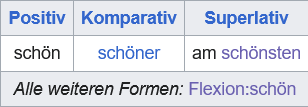

[TOC]

## Wikitext Syntax

**Wikitext**, also known as **wikicode**, is a lightweight markup language used across Wikimedia projects, including Wikipedia and the German Wiktionary, to format and organize content. Wikitext provides special syntax for adding links, formatting text, creating section headings, and more. A key feature of *wikitext* is its use of **templates**, which help standardize and structure the content.

"Wiki contributors" write their entries in **wikitext**, which is then processed and displayed as a formatted *wikipage*.

Below, some examples of *wikitext* syntax, for a more detailed overview  of the *wikitext* syntax [here](https://en.wikipedia.org/wiki/Help:Wikitext) and more examples [here.](https://www.mediawiki.org/wiki/Help:Wikitext_examples)

> **Examples of *wikitext* syntax:**
> 
> - **Headings**: Created using equal signs (`=`), with the number of equal signs on either side of the heading indicating its level.
> ```wikitext
> = Main Heading =
> == Subheading ==
> ```
> - **Templates**: Defined within double curly braces (`{{ }}`) 
> ```wikitext
> {{template_name|non-named-parameter|named-param=value}}
> ```
> - **Internal Links**: Formatted with double square brackets (`[[ ]]`).
> - **Bold Text**: Indicated with triple quotes (`'''bold'''`).
> - **Italics**: Indicated with double quotes (`''italics''`).

 
Although regular expressions can be used to parse *wikitext*, doing so can be quite challenging. This is especially true because *wikitext* allows for nested templates and uses quotation marks for both bold and italic text, among other formatting features.

Fortunately, there are some Python packages available for parsing *wikitext*. For a full list of parsers available in different languages, visit this [wiki page](https://www.mediawiki.org/wiki/Alternative_parsers).

In this tutorial, we will use the package [`mwparserfromhell`](https://github.com/earwig/mwparserfromhell/). You can check out the project site on GitHub [here](https://github.com/earwig/mwparserfromhell/) and view its documentation page [here](https://mwparserfromhell.readthedocs.io/en/latest/).

Although I have not had the chance to use it, another Python wiki parser that may be worth exploring is [`wikitextparser`](https://github.com/5j9/wikitextparser).


## Wiki Namespaces  
Wikimedia projects use **namespaces** to organize and categorize pages based on their purpose, such as main content pages, templates, help pages, and discussion pages.

Below is a list of some important namespaces in the German Wiktionary.  For the full list, see [here](https://de.wiktionary.org/wiki/Hilfe:Namensr%C3%A4ume).


| ID  | Description                                                                                                        | Prefix English | Prefix German | Count<br>in Wiktionary |
| --- | ------------------------------------------------------------------------------------------------------------------ | -------------- | ------------- | ---------------------- |
| 0 | The **Main namespace**, or default namespace, contains the actual content.<br>- word entries of dictionary section | -              | -             | 1,142,612 pages        |
| 108 | For **Flexion** pages.                                                                                             | Flexion        | Flexion       | 67,542                 | 
| 106 | For List of **rhyming** words.                                                                                     | Reim           | Reim          | 48,028                 |
| 10  | For **Template/Vorlage** pages.                                                                                    | Template       | Vorlage       | 7,258                  |
| 12  | For **Help/Hilfe** resources.                                                                                    | Help           | Hilfe         | 588                    |


 

Namespaces have an ID (such as `'0'`, `'108'`) and prefixes. The prefixes are part of the page titles and help with navigating the site. The only namespace without a prefix is the main content namespace (`'0'`).

For instance, if you are interested in information about the word *schön*, you can visit the main content page for [*schön*](https://de.wiktionary.org/wiki/sch%C3%B6n) (without a prefix) or its declension table, which can be found under [*Flexion:schön*](https://de.wiktionary.org/wiki/Flexion:sch%C3%B6n) (with the *Flexion* prefix).

## Wiki Templates

**Templates** (or *Vorlage* in German) can be thought of as small functions. They have a **name**, as well as **named** and **unnamed** **parameters**, which are separated by pipes.

The first, second, third, etc., *unnamed parameters* are assigned the names `1`, `2`, `3`, and so on.

Templates have their own namespace in wiki projects (`'10'`), with the prefix `Template` in English and `Vorlage` in German. This means that if you need to read the documentation for a template in the German Wiktionary, you can simply search for the page titled `Vorlage:name_of_template`.

Below are some examples of templates, including the *wikicode*, their end result on the web page, and their documentation page.

#### **Examples of Templates**

For instance, the template named `Wort der Woche` has two unnamed parameters.

=== "Template"
    ```wikitext 
    {{Wort der Woche|26|2007}}
    ```
=== "Web"
    {width="300"}

=== "Template's docs"
    [Wort der Woche - Template docs](https://de.wiktionary.org/wiki/Vorlage:Wort_der_Woche) 
 

The template `Deutsch Adjektiv Übersicht` generates the declension tables for adjectives. In this example, it has three named parameters: `Positiv`, `Komparativ`, and `Superlativ`.

=== "Template"
    ```wikitext 
    {{Deutsch Adjektiv Übersicht
    |Positiv=schön
    |Komparativ=schöner
    |Superlativ=schönsten
    }}
    ``` 
=== "Web"
    {width="300"}
=== "Template's docs"
    [Deutsch Adjektiv Übersicht - Template docs](https://de.wiktionary.org/wiki/Vorlage:Deutsch Adjektiv Übersicht) 
 

Different word forms rely on different templates to generate the inflection tables. For instance, verbs use the `Deutsch Verb Übersicht` template.

=== "Template"
    ```wikitext 
    {{Deutsch Verb Übersicht
    |Präsens_ich=arbeite
    |Präsens_du=arbeitest
    |Präsens_er, sie, es=arbeitet
    |Präteritum_ich=arbeitete
    |Partizip II=gearbeitet
    |Konjunktiv II_ich=arbeitete
    |Imperativ Singular=arbeite
    |Imperativ Plural=arbeitet
    |Hilfsverb=haben
    }}
    ``` 
=== "Web"
    {width="300"}
=== "Template's docs"
    [Deutsch Verb Übersicht - Template docs](https://de.wiktionary.org/wiki/Vorlage:Deutsch Verb Übersicht) 
 

Templates can hide large amounts of code behind the scenes; for example, this small template produces a large table.

=== "Template"
    ```wikitext 
    {{Deklinationsseite Adjektiv
    |Positiv-Stamm=schön
    |Komparativ-Stamm=schöner
    |Superlativ-Stamm=schönst
    }}
    ```
=== "Web"
    {width="200"}
=== "Template's docs"
    [Deklinationsseite Adjektiv - Template docs](https://de.wiktionary.org/wiki/Vorlage:Deklinationsseite Adjektiv) 
 


<!-- 
> [!NOTE]- Other examples
> 
> /// tab | Template
> 
> ```md
> {{Sprache|Deutsch}}
> ```
> ///
> ///tab| Result
> [Deutsch](https://de.wiktionary.org/wiki/Wiktionary:Deutsch "Wiktionary:Deutsch")
> ///
> 
> 
> /// tab | Template
>         new: true
> ```md
> {{Wortart|Adjektiv|Deutsch}}
> ```
> ///
> ///tab | Result
> [Adjektiv](https://de.wiktionary.org/wiki/Hilfe:Wortart#Adjektiv "Hilfe:Wortart")
> /// -->
